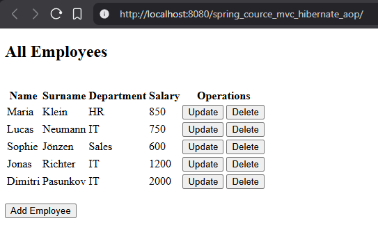
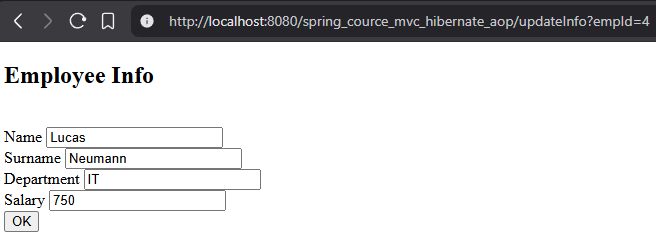

# Spring MVC + Hibernate CRUD Application

This is a classic **Spring MVC (non-Spring Boot)** CRUD application for managing employees.

The application allows users to **view, add, update and delete employees** via a web interface (JSP).
All changes are persisted in a **MySQL database** using **Hibernate ORM**.

The project also demonstrates:
- **Spring AOP** for logging repository method execution
- **DAO pattern** for clean separation of persistence logic

## ✨ Features

- Full CRUD operations for employees (Create, Read, Update, Delete)
- Web interface built with **Spring MVC + JSP**
- Persistence layer implemented with **Hibernate ORM**
- **DAO pattern** used for database access
- **Spring AOP logging** with `@Around` advice
- MySQL database integration
- Classic layered architecture (Controller → Service → DAO)

## Screenshots

### Employee List


### Add / Edit Employee


## 🛠 Requirements

- ☕ Java 8 or higher
- 📦 Maven
- 🐬 MySQL 8.x
- 🐱 Apache Tomcat 9.x
- 💡 IntelliJ IDEA (recommended)

## 🚀 How to Run

### 1️⃣ Clone the repository

Clone this repository to your local machine:
```bash
git clone https://github.com/<your-username>/spring-mvc-hibernate-aop-crud.git
```
Or download it as a ZIP archive and extract it.

### 2️⃣ Open the project in IntelliJ IDEA

Open IntelliJ IDEA

Select File → Open

Choose the project folder

IntelliJ will automatically detect the Maven project (pom.xml)

Make sure Maven dependencies are downloaded successfully.

### 3️⃣ Install MySQL

Make sure **MySQL is installed and running** on your computer.

- MySQL version: **8.x**
- Default port: **3306**

You can check MySQL installation by running:

```bash
mysql --version
```

Or by opening MySQL Workbench.

### 4️⃣ Create a local database

Open MySQL Workbench (or terminal) and run:

```sql
CREATE DATABASE my_db;
USE my_db;
```
```sql
Create table
CREATE TABLE employees (
  id INT NOT NULL AUTO_INCREMENT,
  name VARCHAR(15),
  surname VARCHAR(25),
  department VARCHAR(20),
  salary INT,
  PRIMARY KEY (id)
);
```
```sql
(Optional) Add test data
INSERT INTO employees (name, surname, department, salary) VALUES
('Lucas', 'Neumann', 'IT', 1200),
('Sophie', 'Keller', 'HR', 900),
('Maria', 'Klein', 'Sales', 950);
```


✅ Database is ready.

### 5️⃣ Configure database credentials

Open file:

src/main/resources/applicationContext.xml

Find this section:

```bash
<bean id="dataSource"
      class="com.mchange.v2.c3p0.ComboPooledDataSource"
      destroy-method="close">

    <property name="driverClass" value="com.mysql.cj.jdbc.Driver"/>
    <property name="jdbcUrl"
              value="jdbc:mysql://localhost:3306/my_db?useSSL=false"/>
    <property name="user" value="root"/>
    <property name="password" value="root"/>

</bean>
```

You can change if needed:

jdbcUrl → database name

user → MySQL username

password → MySQL password

### 6️⃣ Run the application

This is a **classic Spring MVC application**, so it must be deployed to **Apache Tomcat**.

### 🚀 Steps

- 🐱 **Download Apache Tomcat 9.x**  
  Example: `apache-tomcat-9.0.113`

- 💡 **Open the project in IntelliJ IDEA**

- ⚙️ **Open Run Configurations**  
Run → Edit Configurations


- ➕ **Add a new configuration**

- 🧩 **Select Tomcat Server**  
Application Server → Tomcat Server → Local


- 🔧 **Configure Tomcat**
- Click **Application Server → Configure**
- Choose the Tomcat installation folder

- 📦 **Deploy the application**
- Click **Fix** → *Select artifact to deploy*
- Choose: `spring_course_mvc:war exploded`

- ▶️ **Start the server** (Run)

- 🌍 **Open browser**
http://localhost:8080/


🎉 **You should see the employee table in the browser.**

---

## ℹ️ Important Notes

- The database is **not included** in the repository
- Each developer creates the database locally
- All UI changes are persisted in MySQL
- No additional MySQL users or connections are required

---
This project was built as a learning and portfolio project to demonstrate classic Spring MVC architecture.
